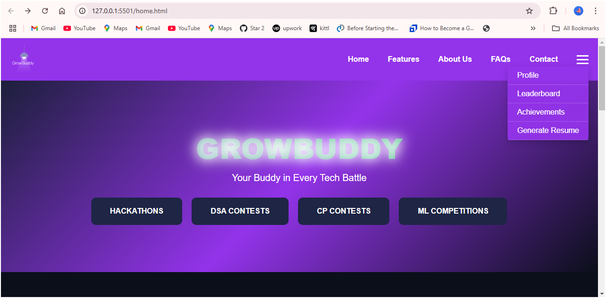
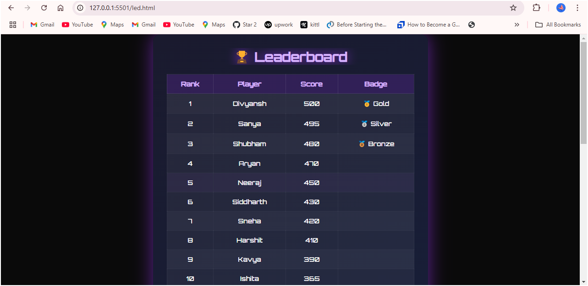
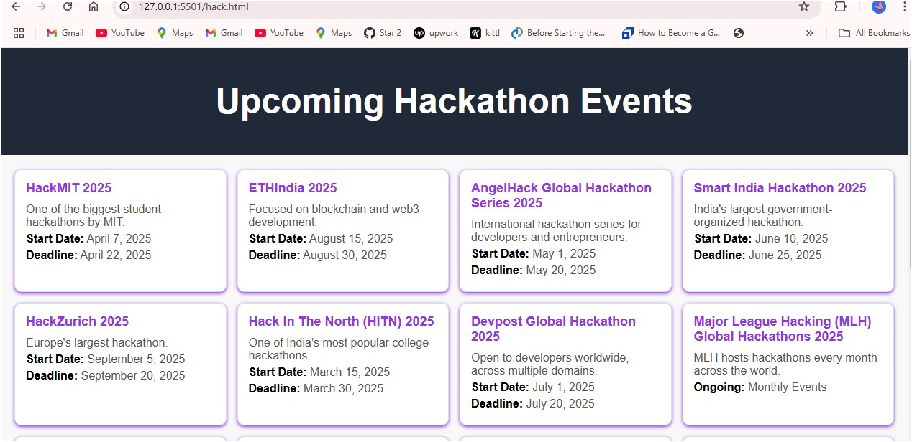
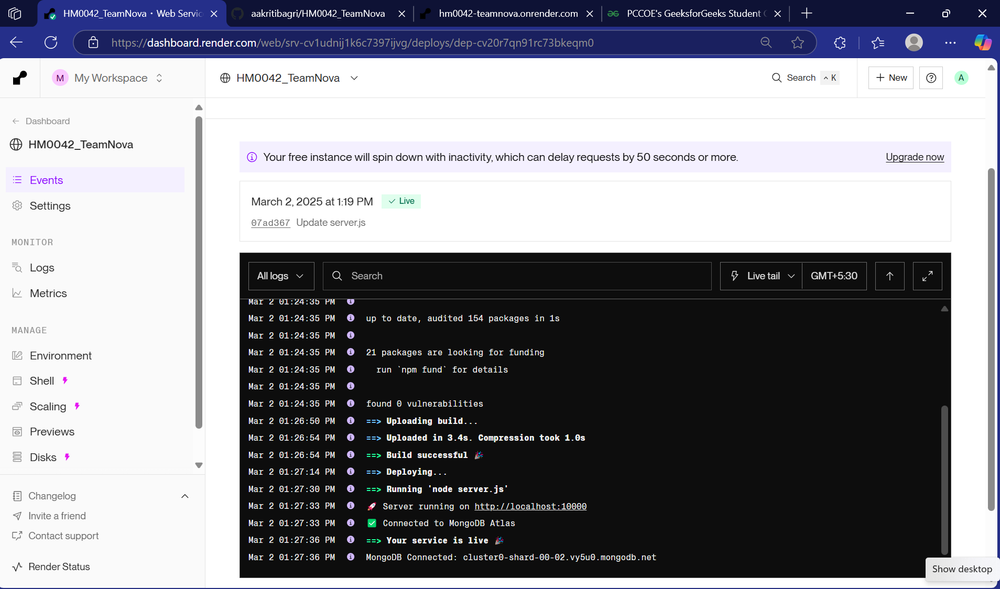

# HM0042 TeamNova

# Grow Buddy : Coding Competitions & Hackathons Platform

## Overview

This project is a web-based platform for hosting and participating in various coding challenges, such as hackathons, DSA contests, CP contests, and machine learning competitions. Organizers may easily post events on the platform, and participants can apply without difficulty. It has a gamified leveling system with awards, as well as a leaderboard with social sharing capabilities, to increase engagement and competition.

## Features
- **Event Hosting** : Organizers can create and manage competitions.
- **Participant Registration** : Easy sign-up for contests.
- **Gamification System** : Levels, badges, and rewards for achievements.
- **Leaderboards & Ranking** : Real-time score tracking.
- **Social Sharing** : Share achievements and competitions.
- **Discussion Forums** : Community engagement and doubt resolution.
- **AI-Based Recommendations** : Suggests relevant competitions based on user skills.
- **AI-Generated Resume** : Generates Resume by filling out neccessary details.

## Tech Stack
- Frontend: HTML, CSS, Javascript
- Backend: Node.js, Express.js
- Database: MongoDB, MongoDB Atlas
- Version Control: Git
- API Testing & Documentation: Postman
- Hosting: Render 
- Code Editor: VS Code

## Screenshots

## Deployed Url
https://hm0042-teamnova.onrender.com

## Video Url
https://youtu.be/IQdxVNoVH6s?si=EwOy5PM9FdScrAh-

## Remarks
- Grow Buddy is a gamified competition platform for hosting and participating in DSA, CP, and ML contests with real-time leaderboards.
- Uses scalable database (MongoDB) for efficient data handling.
- Features seamless event hosting, participant registration, and social sharing to enhance engagement.
